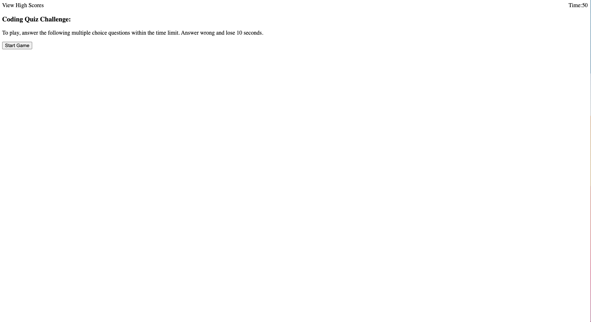

# Taylor Anderson
# 04 Web APIs: Code Quiz

# Screenshot



# Deployed Application

https://newengood.github.io/homework-04-codeQuiz/

## Acceptance Criteria

```
GIVEN I am taking a code quiz
WHEN I click the start button
THEN a timer starts and I am presented with a question - [X]
WHEN I answer a question
THEN I am presented with another question - [X]
WHEN I answer a question incorrectly
THEN time is subtracted from the clock - [X]
WHEN all questions are answered or the timer reaches 0
THEN the game is over - [X]
WHEN the game is over
THEN I can save my initials and my score - [X]
```

## Grading Requirements

### Technical Acceptance Criteria: 40%

* Satisfies all of the preceding acceptance criteria.- [X]

### Deployment: 32%

* Application deployed at live URL. - [X]

* Application loads with no errors. - [X]

* Application GitHub URL submitted. - []

* GitHub repository contains application code. - [X]

### Application Quality: 15%

* Application user experience is intuitive and easy to navigate. - [X]

* Application user interface style is clean and polished. - [X]

* Application resembles the mock-up functionality provided in the homework instructions. - [X]

### Repository Quality: 13%

* Repository has a unique name. - [X]

* Repository follows best practices for file structure and naming conventions. - [X]

* Repository follows best practices for class/id naming conventions, indentation, quality comments, etc. - [X]

* Repository contains multiple descriptive commit messages. - [X]

* Repository contains quality readme file with description, screenshot, and link to deployed application. - [X]

---

© 2021 Newengood
